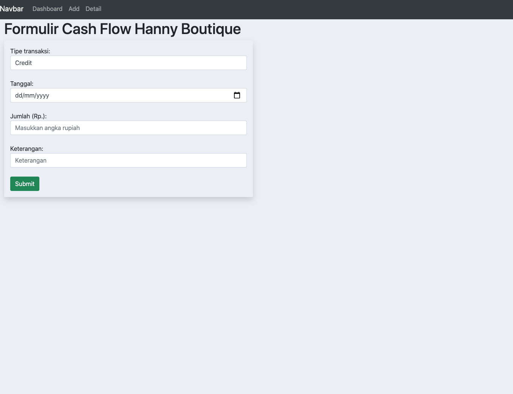
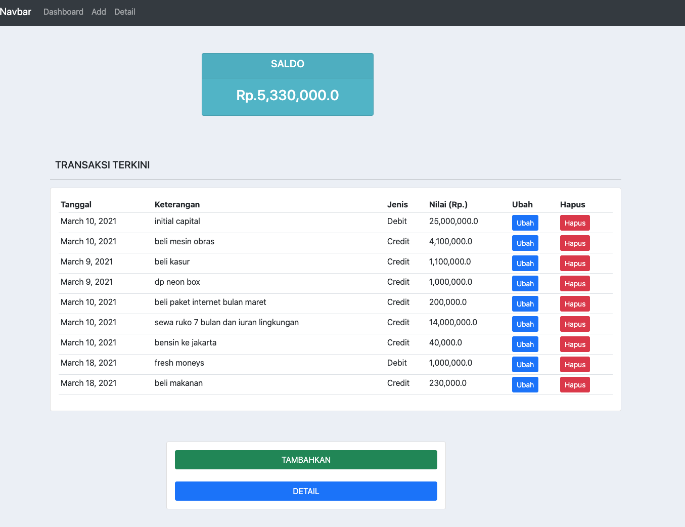
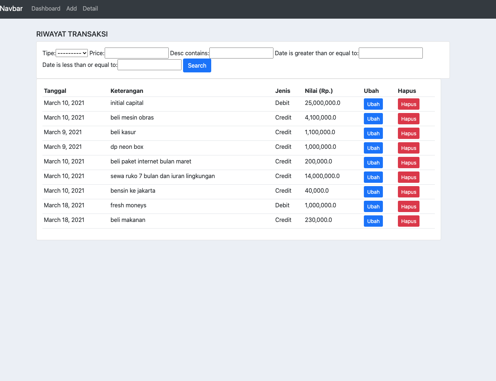

# hboutique-journal

4 fitur utama hboutique-jurnal (pengembangan projectPertama):

1. menambahkan jurnal harian (create method)

2. melihat laporan/dashboard jurnal  
3. menghapus dan mengubah data 

4. memfilter transkasi masa lalu

